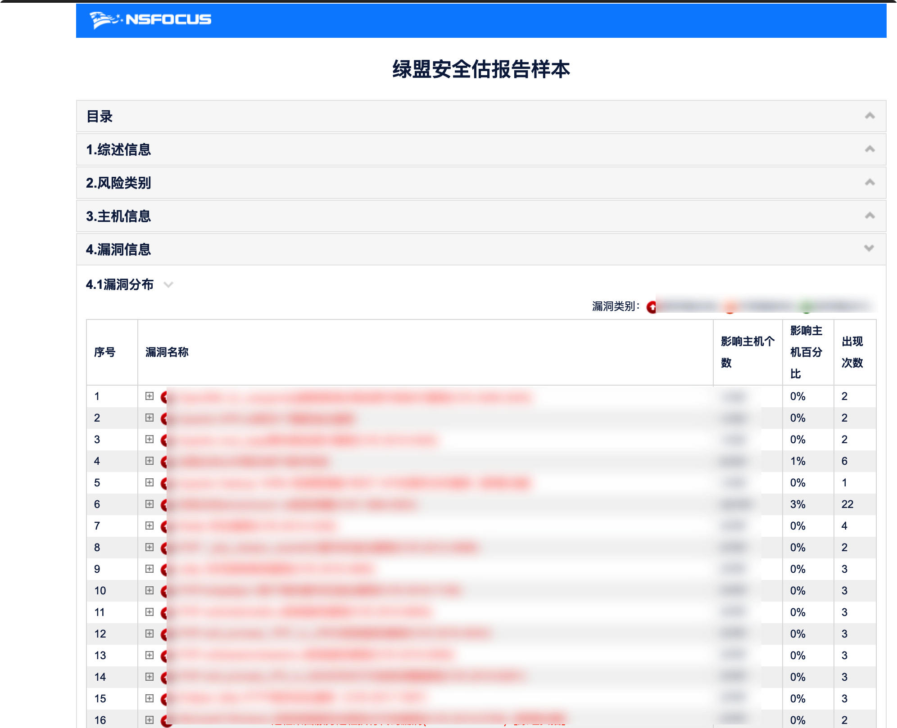
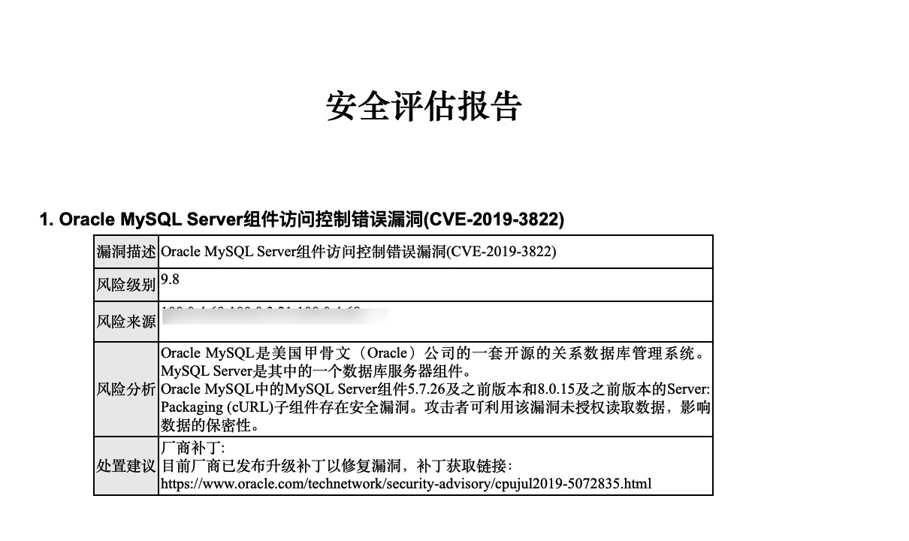

# Nsfocus2docx
pass html  to docx


日常安全扫描场景中，有需要将绿盟的Web漏扫报告(html)转换成docx文档格式的需求，
因此使用python3写了个脚本，使用模块如下
- BeautifulSoup
- docxtpl

## 原始报告




## 转换成docx报告


## 使用
```zsh
python3 Nsfocus2docx  /path/to/NS_report/index.html
```

## 已知Bug

` doc.render(data) `渲染数据时，
- 199个漏洞，只能渲染89个，
- 1362个漏洞只能渲染出639个

欢迎For，PR

